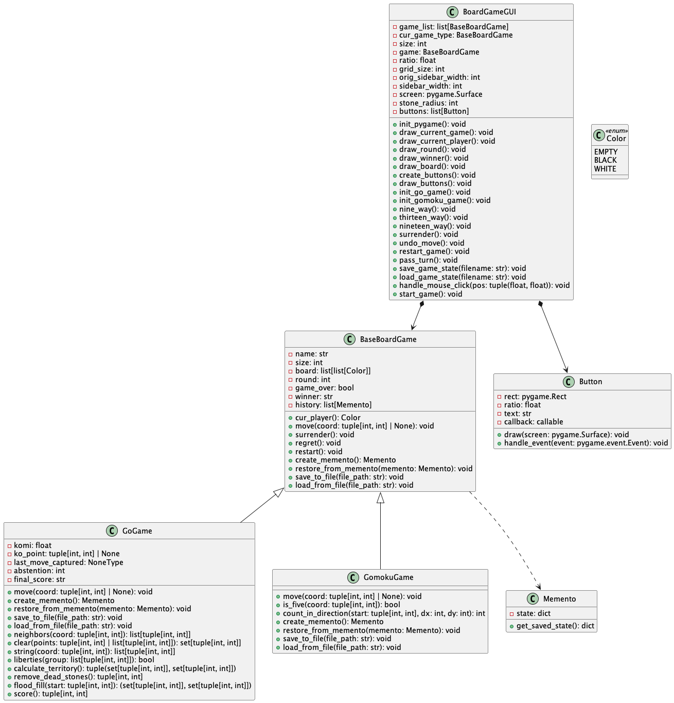
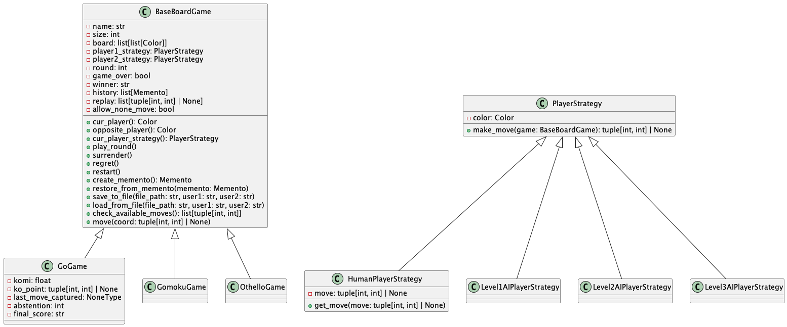

## chess

[TOC]

### 第一阶段

#### 围棋和五子棋基本规则

围棋参考 [Tromp-Taylor](https://webdocs.cs.ualberta.ca/~hayward/355/gorules.pdf) 规则：

- 棋盘被分为黑白色和空三种状态。
- 一个点 P 被称为到达点 C，如果存在一条路径，由 P 的颜色相邻（垂直或者水平）的路径从 P 到达 C。
- 清除点是将所有未达到空的该颜色点位清空的过程。
- 一个回合可以是跳过或者移动，但不能重复之前的格子着色（superko）。
- **一次移动包括将一个空点涂上自己的颜色；然后清除对手的颜色，最后清除自己的颜色。**
- 游戏在连续两次跳过后结束。
- 一个玩家的得分是他颜色的点数加上只能被他颜色到达的空白点数。

五子棋规则：垂直、水平或者斜线五子成线（或者大于五子）

其它额外的规则：支持悔棋、重开、认输、自动判负

#### BaseBoardGame

从上面的描述抽象出基类 BaseBoardGame，包括游戏名称、棋盘大小、轮次、历史记录等属性，实现了投降、悔棋、重开等方法，同时需要子类实现每一轮操作的抽象类 move。

```python
class BaseBoardGame(ABC):
    def __init__(self, size: int):
        self.name = ""
        self.size = size
        self.board = [[Color.EMPTY for _ in range(size)] for _ in range(size)]
        self.round = 0
        self.game_over = False
        self.winner = ""
        self.history: list[Memento] = []  # Use a list of Mementos for the history

    def cur_player(self) -> Color:
        return Color.BLACK if self.round % 2 == 0 else Color.WHITE

    @abstractmethod
    def move(self, coord: tuple[int, int] | None = None):
        raise NotImplementedError

    def surrender(self):
        self.game_over = True
        self.winner = "White" if self.cur_player() == Color.BLACK else "Black"
        logger.info(f"{self.winner} wins.")

    def regret(self):
        if len(self.history) > 0:
            self.restore_from_memento(self.history.pop())
            logger.info("Move undone.")
        else:
            self.restart()

    def restart(self):
        self.__init__(self.size)

    @abstractmethod
    def create_memento(self) -> Memento:
        raise NotImplementedError

    @abstractmethod
    def restore_from_memento(self, memento: Memento):
        raise NotImplementedError

    @abstractmethod
    def save_to_file(self, file_path: str):
        raise NotImplementedError

    @abstractmethod
    def load_from_file(self, file_path: str):
        raise NotImplementedError
```

由于还需要支持局面的保存与读取功能，因此采用备忘录模式，Memento 类作为快照，BaseBoardGame 作为 Originator 和 Caretaker。

```python
class Memento:
    def __init__(self, state: dict):
        self.__state = state

    def get_saved_state(self):
        return self.__state
```

#### Go Game

- 一次 move 需要做的事情是
  - 判断游戏是否结束，如果结束则不能继续下棋。
  - 是否是重复上一次格点染色（superko），通过一个 self.ko_point 记录
  - 将当前状态加入到历史记录，以便实现悔棋功能
  - 对格点着色
  - 对于着色点周围不同颜色判断是否需要清除（clear 函数）
  - 对自身进行清除
  - 记录是否是 ko_point
- clear 函数通过 string 函数找到相连的同色的 group，通过 liberties 函数判断是否要清除
- string 函数通过 BFS 找到同色的相连的 group
- liberties 通过遍历每个点的邻居点是否是空判断是否有“气”
- score 分数是点数+领地数量，领地数量通过洪水算法判断是否是只被一种颜色到达

```python
class GoGame(BaseBoardGame):
    # Rule 1: Go is played on a 19x19 square grid of points, by two players called Black and White.
    def __init__(self, size: int):
        # Rule 2: Each point on the grid may be colored black, white or empty.
        super().__init__(size)
        self.name = "Go Game"
        self.komi = 6.5
        self.ko_point: tuple[int, int] | None = None
        self.last_move_captured = None
        self.abstention = 0
        self.final_score = ""

    def move(self, coord: tuple[int, int] | None = None):
        if self.game_over:
            return
        if coord is not None:
            # Rule 6: A turn is either a pass or a move that doesn’t repeat an earlier grid coloring (superko).
            if self.ko_point == coord:
                logger.info("Cannot recapture ko immediately.")
                return

            self.history.append(self.create_memento())

            # Rule 5: Starting with an empty grid, the players alternate turns, starting with Black.
            current_color = self.cur_player()
            opposite_color = Color.WHITE if current_color == Color.BLACK else Color.BLACK
            x, y = coord
            # Rule 7: A move consists of coloring an empty point one’s own color; then clearing the opponent color, and then clearing one’s own color.
            self.board[x][y] = current_color
            opponent = [nbr for nbr in self.neighbors(coord) if self.board[nbr[0]][nbr[1]] == opposite_color]
            captured = self.clear(opponent)

            # set ko point
            if len(captured) == 1:
                self.ko_point = captured.pop()
            else:
                self.ko_point = None

            self.clear(coord)
        else:  # pass
            self.history.append(self.create_memento())
            self.abstention += 1
            # Rule 8: The game ends after two consecutive passes.
            if self.abstention == 2:
                # Rule 10: The player with the higher score at the end of the game is the winner. Equal scores result in a tie.
                black_score, white_score = self.score()
                logger.info(f"Game over. Black: {black_score}, White: {white_score}")
                self.game_over = True
                self.winner = f"Black" if black_score > white_score else f"White" if black_score < white_score else f"Tie"
                self.final_score = f"Black: {black_score}, White: {white_score}"

        self.round += 1

    def create_memento(self) -> Memento:
        # Save the current state in a memento
        state = {
            "name": self.name,
            "size": self.size,
            "board": copy.deepcopy(self.board),
            "round": self.round,
            "game_over": self.game_over,
            "winner": self.winner,
            "final_score": self.final_score,
            # "history": copy.deepcopy(self.history),
            "komi": self.komi,
            "ko_point": self.ko_point,
            "last_move_captured": self.last_move_captured,
            "abstention": self.abstention,
        }
        return Memento(state)

    def restore_from_memento(self, memento: Memento):
        # Restore the state from the memento
        state = memento.get_saved_state()
        self.name = state["name"]
        self.size = state["size"]
        self.board = state["board"]
        self.round = state["round"]
        self.game_over = state["game_over"]
        self.winner = state["winner"]
        self.final_score = state["final_score"]
        # self.history = state["history"]
        self.komi = state["komi"]
        self.ko_point = state["ko_point"]
        self.last_move_captured = state["last_move_captured"]
        self.abstention = state["abstention"]

    def save_to_file(self, file_path: str):
        with open(file_path, "wb") as file:
            pickle.dump(self.create_memento(), file)
            logger.info("Game saved to file.")

    def load_from_file(self, file_path: str):
        with open(file_path, "rb") as file:
            self.restore_from_memento(pickle.load(file))
            logger.info("Game loaded from file.")

    def neighbors(self, coord: tuple[int, int]) -> list[tuple[int, int]]:
        x, y = coord
        return [(x, ny) for ny in (y - 1, y + 1) if 0 <= ny < self.size] + [(nx, y) for nx in (x - 1, x + 1) if 0 <= nx < self.size]

    # Rule 4: Clearing a color is the process of emptying all points of that color that don’t reach empty.
    def clear(self, points: tuple[int, int] | list[tuple[int, int]]) -> set[tuple[int, int]]:
        if isinstance(points, tuple):
            points = [points]
        captured = set()
        for pt in points:
            str_points = self.string(pt)
            if not self.liberties(str_points):
                captured.update(str_points)
        for cap in captured:
            self.board[cap[0]][cap[1]] = Color.EMPTY
        return captured

    # Rule 3: A point P, not colored C, is said to reach C if there is a path of (vertically or horizontally) adjacent points of P’s color from P to a point of color C.
    def string(self, coord: tuple[int, int]) -> list[tuple[int, int]]:
        visited = set()
        visited.add(coord)

        queue = deque([coord])

        while queue:
            for nbr in self.neighbors(queue.popleft()):
                if self.board[nbr[0]][nbr[1]] == self.board[coord[0]][coord[1]] and nbr not in visited:
                    visited.add(nbr)
                    queue.append(nbr)

        return visited

    def liberties(self, group: list[tuple[int, int]]) -> bool:
        empty = [nbr for p in group for nbr in self.neighbors(p) if self.board[nbr[0]][nbr[1]] == Color.EMPTY]
        return len(empty) > 0

    def calculate_territory(self) -> tuple(set[tuple[int, int]], set[tuple[int, int]]):
        black_territory = set()
        white_territory = set()
        neutral_territory = set()
        visited = set()

        for x in range(self.size):
            for y in range(self.size):
                if (x, y) in visited or self.board[x][y] != Color.EMPTY:
                    continue

                territory, borders = self.flood_fill((x, y))
                visited.update(territory)

                # Determine the territory's ownership by its borders
                if all(self.board[x][y] == Color.BLACK for x, y in borders):
                    black_territory.update(territory)
                elif all(self.board[x][y] == Color.WHITE for x, y in borders):
                    white_territory.update(territory)
                else:
                    neutral_territory.update(territory)

        return black_territory, white_territory

    def remove_dead_stones(self) -> tuple[int, int]:
        return 0, 0

    def flood_fill(self, start: tuple[int, int]):
        queue = deque([start])
        territory = set([start])
        borders = set()

        while queue:
            x, y = queue.popleft()
            for nx, ny in self.neighbors((x, y)):
                if (nx, ny) in territory:
                    continue

                if self.board[nx][ny] == Color.EMPTY:
                    queue.append((nx, ny))
                    territory.add((nx, ny))
                else:
                    borders.add((nx, ny))

        return territory, borders

    def score(self):
        # Rule 9: A player’s score is the number of points of her color, plus the number of empty points that reach only her color.
        black_captures, white_captures = self.remove_dead_stones()
        black_territory, white_territory = self.calculate_territory()

        black_score = len(black_territory) + white_captures
        white_score = len(white_territory) + black_captures + self.komi

        return black_score, white_score
```

#### Gomoku Game

一次 move 操作只包含染色以及判断垂直、水平和对角线方向是否大于五子成线。

```python
class GomokuGame(BaseBoardGame):
    def __init__(self, size: int):
        super().__init__(size)
        self.name = "Gomoku Game"

    def move(self, coord: tuple[int, int] | None = None):
        if self.game_over:
            return
        if coord is None:
            logger.warning("Coord cannot be None.")
            return
        self.history.append(self.create_memento())
        x, y = coord
        self.board[x][y] = self.cur_player()
        if self.is_five(coord):
            self.game_over = True
            logger.info(f"{self.cur_player().value} wins.")
        self.round += 1

    def is_five(self, coord: tuple[int, int]) -> bool:
        directions = [(1, 0), (0, 1), (1, 1), (1, -1)]
        for d in directions:
            if self.count_in_direction(coord, d[0], d[1]) + self.count_in_direction(coord, -d[0], -d[1]) - 1 >= 5:
                return True
        return False

    def count_in_direction(self, start: tuple[int, int], dx: int, dy: int) -> int:
        count = 0
        x, y = start
        while 0 <= x < self.size and 0 <= y < self.size and self.board[x][y] == self.cur_player():
            count += 1
            x += dx
            y += dy
        return count

    def create_memento(self) -> Memento:
        # Save the current state in a memento
        state = {
            "name": self.name,
            "size": self.size,
            "board": copy.deepcopy(self.board),
            "round": self.round,
            "game_over": self.game_over,
            "winner": self.winner,
            # "history": copy.deepcopy(self.history),
        }
        return Memento(state)

    def restore_from_memento(self, memento: Memento):
        # Restore the state from the memento
        state = memento.get_saved_state()
        self.name = state["name"]
        self.size = state["size"]
        self.board = state["board"]
        self.round = state["round"]
        self.game_over = state["game_over"]
        self.winner = state["winner"]
        # self.history = state["history"]

    def save_to_file(self, file_path: str):
        with open(file_path, "wb") as file:
            pickle.dump(self.create_memento(), file)
            logger.info("Game saved to file.")

    def load_from_file(self, file_path: str):
        with open(file_path, "rb") as file:
            self.restore_from_memento(pickle.load(file))
            logger.info("Game loaded from file.")
```

#### GUI 设计

GUI和后端算法的分离采用策略模式，BaseBoardGame 基类定义了一系列的算法或行为，比如 move、regret、restart等等，这些都是抽象的操作。任何继承自 BaseBoardGame 的子类都必须提供这些抽象方法的具体实现。GUI 类则充当策略模式中的上下文（Context），它不关心具体的实现细节，只依赖于BaseBoardGame 基类的接口。

GUI 的代码比较冗长无聊，主要是在 start_game 体现策略模式，这里都使用 BaseBoardGame 的抽象方法，这样可以轻松地更换不同的游戏逻辑（即 BaseBoardGame 的不同子类），而 GUI 类不需要做任何改变。这提高了代码的复用性和灵活性，同时也遵循了设计原则中的“依赖倒置原则”（Dependence Inversion Principle），即高层模块不应该依赖于低层模块，两者都应该依赖于抽象。

```python
class BoardGameGUI:
  	# ...
    
    def surrender(self):
        self.game.surrender()

    def undo_move(self):
        self.game.regret()

    def restart_game(self):
        self.game.restart()

    def pass_turn(self):
        self.game.move(None)

    def save_game_state(self, filename):
        self.game.save_to_file(filename)

    def load_game_state(self, filename):
        self.game.load_from_file(filename)

    def start_game(self):
        running = True
        while running:
            for event in pygame.event.get():
                if event.type == pygame.QUIT:
                    running = False
                elif event.type == pygame.MOUSEBUTTONDOWN:
                    if event.button == 1:
                        for button in self.buttons:
                            button.handle_event(event)
                        pos = pygame.mouse.get_pos()
                        self.handle_mouse_click(pos)
                elif event.type == pygame.KEYDOWN:
                    if event.key == pygame.K_u:
                        self.undo_move()
                    elif event.key == pygame.K_r:
                        self.restart_game()
                    elif event.key == pygame.K_p:
                        self.pass_turn()
                    elif event.key == pygame.K_s:
                        self.save_game_state("game_state.pickle")
                    elif event.key == pygame.K_l:
                        self.load_game_state("game_state.pickle")
                    elif event.key == pygame.K_q:
                        running = False
                self.create_buttons()
                self.draw_board()
                self.draw_current_game()
                self.draw_current_player()
                self.draw_round()
                self.draw_winner()
                self.draw_buttons()
            pygame.display.flip()

        pygame.quit()
        sys.exit()


if __name__ == "__main__":
    gui = BoardGameGUI()
    gui.start_game()
```

#### UML 图



### 第二阶段

#### Othello Game

黑白棋的规则是，在垂直、水平或者斜线的方向夹住对方的棋即可以翻转对方的棋子为自己的颜色，实现核心如下，即只需要在垂直水平和斜线 8 个方向判断是否有自己的棋子。若有，则把中间的棋子翻转，若所有方向都没有，则不是一个可下的位置。

```python
    def move(self, coord: tuple[int, int] | None):
        if self.game_over:
            return
        # if coord is None:
        #     logger.warning("You cannot pass proactively.")
        #     return
        available_moves = self.check_available_moves()
        if len(available_moves) == 0:
            self.history.append(self.create_memento())
            self.replay.append(None)
            self.round += 1
        else:
            if coord in available_moves:
                self.history.append(self.create_memento())
                self.replay.append(coord)
                self.board[coord[0]][coord[1]] = self.cur_player()
                self.clamp(coord, clear=True)
                if self.check_game_over():
                    self.game_over = True
                    self.winner = self.get_winner()
                self.round += 1
            else:
                logger.warning("Invalid move.")

    def clamp(self, coord: tuple[int, int], clear: bool = False, return_count: bool = False) -> bool | tuple[bool, int]:
        directions = [(1, 0), (0, 1), (1, 1), (1, -1), (-1, 0), (0, -1), (-1, -1), (-1, 1)]
        if return_count:
            return any([self.clamp_direction(coord, d[0], d[1], clear=clear, return_count=return_count)[0] for d in directions]), sum(
                [self.clamp_direction(coord, d[0], d[1], clear=clear, return_count=return_count)[1] for d in directions]
            )
        return any([self.clamp_direction(coord, d[0], d[1], clear=clear) for d in directions])

    def clamp_direction(self, coord: tuple[int, int], dx: int, dy: int, clear: bool = False, return_count: bool = False) -> bool | tuple[bool, int]:
        x, y = coord
        x += dx
        y += dy
        opposite_list = []
        while 0 <= x < self.size and 0 <= y < self.size and self.board[x][y] == self.opposite_player():
            opposite_list.append((x, y))
            x += dx
            y += dy
        if 0 <= x < self.size and 0 <= y < self.size and self.board[x][y] == self.cur_player():
            if clear:
                for opposite in opposite_list:
                    self.board[opposite[0]][opposite[1]] = self.cur_player()
            if return_count:
                return len(opposite_list) > 0, len(opposite_list)
            return len(opposite_list) > 0
        if return_count:
            return False, 0
        return False
```

判断为终局的条件是，黑子和白子都没地方可下，或者是棋盘已被填满，获胜条件是谁剩余的子多：

```python
    def check_game_over(self) -> bool:
        # Implement the logic to check if the game is over
        cur_available_moves = self.check_available_moves()
        self.round += 1
        next_available_moves = self.check_available_moves()
        self.round -= 1
        return len(cur_available_moves) == 0 and len(next_available_moves) == 0

    def check_available_moves(self) -> list[tuple[int, int]]:
        available_moves = []
        for x in range(self.size):
            for y in range(self.size):
                if self.board[x][y] == Color.EMPTY and self.clamp((x, y), clear=False):
                    available_moves.append((x, y))
        return available_moves
```

#### 录像与回放

录像和回放功能只需要在 BaseBoardGame 基类添加一个 replay 列表，这个列表保存着游戏每一步的落子位置。回放功能只需要重置棋盘后用 replay 重新下一遍。

```python
class BaseBoardGame(ABC):
    def __init__(self, size: int, player1_strategy: PlayerStrategy, player2_strategy: PlayerStrategy):
        # ...
        self.replay: list[tuple[int, int] | None] = []
        # ...

class BoardGameGUI:
    def playback(self):
        replay_back = copy.deepcopy(self.game.replay)
        self.game.__init__(self.size, self.game.player1_strategy, self.game.player2_strategy)
        for move in replay_back:
            sleep(0.5)
            self.update_gui()
            self.game.move(move)
```

#### AI 功能

AI 功能通过策略模式加入 BaseBoardGame 基类，PlayerStrategy 定义一个基类，HumanPlayerStrategy 和 Level1AIPlayerStrategy 等继承该基类。HumanPlayerStrategy 通过 get_move 获得落子位置，get_move 在 GUI 类给出。Level1AIPlayerStrategy 实现从可落子位置随机取一个位置落子。Level2AIPlayerStrategy 使用简单的人工规则。对于五子棋来说比较简单能战胜 random AI，即每次落子位置在垂直、水平或者斜线方向有子即可。对于黑白棋来说，比较简单的落子的分数 = 能翻转对方子的数量 - 落完该子后对方能够翻转我们的最大数量。但这种方式并不能稳定战胜 random AI，因此加入一些经验下法：1）如果有四个角落能下，则必下这四个位置，这是因为这四个角落无法被翻转，能够掌握主动权；2）边缘位置的分数 +1，这是对边缘位置的奖励，因为边缘位置也不容易被翻转。加入这两条规则后可以稳定战胜 random AI。

```python


class PlayerStrategy(ABC):
    role = None
    color = Color.BLACK

    def __init__(self, color):
        self.color = color

    @abstractmethod
    def make_move(self, game: BaseBoardGame) -> tuple[int, int] | None:
        pass


class HumanPlayerStrategy(PlayerStrategy):
    role = "Human"
    move = None

    def get_move(self, move: tuple[int, int] | None):
        self.move = move

    def make_move(self, game: BaseBoardGame) -> tuple[int, int] | None:
        return self.move


class Level1AIPlayerStrategy(PlayerStrategy):
    role = "Level1 AI"

    # Random Move
    def make_move(self, game: BaseBoardGame) -> tuple[int, int] | None:
        available_moves = game.check_available_moves()
        if game.allow_none_move:
            available_moves.append(None)
        if len(available_moves) == 0:
            return None
        return random.choice(available_moves)


class Level2AIPlayerStrategy(PlayerStrategy):
    role = "Level2 AI"

    # Simple Rules
    def make_move(self, game: BaseBoardGame) -> tuple[int, int] | None:
        if game.name == "Gomoku Game":
            available_moves = game.check_available_moves()
            best_move = random.choice(available_moves)
            best_score = -1
            for x, y in available_moves:
                game.board[x][y] = self.color
                _, score = game.is_five((x, y), return_max_count=True)
                if score > best_score:
                    best_move = (x, y)
                    best_score = score
                game.board[x][y] = Color.EMPTY
            return best_move
        elif game.name == "Othello Game":
            available_moves = game.check_available_moves()
            if len(available_moves) == 0:
                return None
            corner_points = [(0, 0), (0, game.size - 1), (game.size - 1, 0), (game.size - 1, game.size - 1)]
            edge_points = (
                [(0, y) for y in range(game.size)]
                + [(game.size - 1, y) for y in range(game.size)]
                + [(x, 0) for x in range(game.size)]
                + [(x, game.size - 1) for x in range(game.size)]
            )
            for x, y in available_moves:
                if (x, y) in corner_points:
                    return x, y
            best_move = random.choice(available_moves)
            best_score = -99999999
            for x, y in available_moves:
                board_back = copy.deepcopy(game.board)
                game.board[x][y] = self.color
                game.round += 1
                _, score = game.clamp((x, y), clear=True, return_count=True)

                opposite_available_moves = game.check_available_moves()
                best_opposite_score = -99999999
                for i, j in opposite_available_moves:
                    game.board[i][j] = Color.WHITE if self.color == Color.BLACK else Color.BLACK
                    game.round += 1
                    _, opposite_score = game.clamp((i, j), clear=False, return_count=True)
                    if opposite_score > best_opposite_score:
                        best_opposite_score = opposite_score
                    game.board[i][j] = Color.EMPTY
                    game.round -= 1

                if (x, y) in edge_points:
                    score += 0.5
                score -= best_opposite_score
                if score > best_score:
                    best_move = (x, y)
                    best_score = score
                game.round -= 1
                game.board = board_back
            logger.info(f"Best score: {best_score}, best move: {best_move}")
            return best_move
```

加入玩家策略后，BaseBoardGame 的落子位置需要由 cur_player_strategy 的 make_move 给出。

```python
class BaseBoardGame(ABC):
    def __init__(self, size: int, player1_strategy: PlayerStrategy, player2_strategy: PlayerStrategy):
        self.name = ""
        self.size = size
        self.board = [[Color.EMPTY for _ in range(size)] for _ in range(size)]
        self.player1_strategy = player1_strategy
        self.player2_strategy = player2_strategy
        self.round = 0
        self.game_over = False
        self.winner = ""
        self.history: list[Memento] = []  # Use a list of Mementos for the history
        self.replay: list[tuple[int, int] | None] = []
        self.allow_none_move = False
  
    def cur_player_strategy(self) -> PlayerStrategy:
        return self.player1_strategy if self.cur_player() == Color.BLACK else self.player2_strategy

    def play_round(self):
        move = self.cur_player_strategy().make_move(self)
        self.move(move)
```

#### 用户账户管理

一条帐号记录包括密码，围棋、五子棋和黑白棋游戏获胜次数和总次数的信息，这里用 AccountInfo 字典保存一条记录。帐号信息管理在 accounts.json 文件中，AccountManager 实现了加载帐号信息、保存帐号信息、注册、登陆以及游戏后更新获胜或者失败记录。密码使用哈希加密保存。

```python
from __future__ import annotations

import copy
import hashlib
import json
import os
from typing import TypedDict

from loguru import logger


class AccountInfo(TypedDict):
    password: str
    go_games_played: int
    go_wins: int
    gomoku_games_played: int
    gomoku_wins: int
    othello_games_played: int
    othello_wins: int


class AccountManager:
    def __init__(self, filename="accounts.json"):
        self.filename = filename
        self.accounts = self.load_accounts()
        self.login_state = {key: False for key, _ in self.accounts.items()}

    def load_accounts(self):
        if not os.path.exists(self.filename):
            return {}
        with open(self.filename, "r") as file:
            return json.load(file)

    def save_accounts(self):
        with open(self.filename, "w") as file:
            json.dump(self.accounts, file, indent=4)

    def _hash_password(self, password: str) -> str:
        # Use a secure hashing algorithm with a salt
        salt = os.urandom(32)  # A new salt for this user
        hashed_password = hashlib.pbkdf2_hmac("sha256", password.encode("utf-8"), salt, 100000)
        return (salt + hashed_password).hex()

    def verify_password(self, username, password: str):
        salt_from_storage = bytes.fromhex(self.accounts[username]["password"])[:32]  # The salt from the stored password
        stored_password = bytes.fromhex(self.accounts[username]["password"])[32:]
        hashed_password = hashlib.pbkdf2_hmac("sha256", password.encode("utf-8"), salt_from_storage, 100000)
        return hashed_password == stored_password

    def register(self, username: str, password: str):
        if username in self.accounts:
            logger.warning("Username already exists")
            return False  # Username already exists
        self.accounts[username] = AccountInfo(
            password=self._hash_password(password),
            go_games_played=0,
            go_wins=0,
            gomoku_games_played=0,
            gomoku_wins=0,
            othello_games_played=0,
            othello_wins=0,
        )
        self.save_accounts()
        return True

    def login(self, username: str, password: str) -> bool:
        if username not in self.accounts:
            logger.warning("Username does not exist, please register")
            return False  # Username does not exist
        if not self.verify_password(username, password):
            logger.warning("Incorrect password")
            return False
        self.login_state[username] = True
        logger.info("Login successful")
        return True

    def update_record(self, username: str, game: str, win: bool):
        if username not in self.login_state:
            return False
        else:
            if not self.login_state[username]:
                return False
        game_list = ["go", "gomoku", "othello"]
        if game not in game_list:
            return False
        self.accounts[username][f"{game}_games_played"] += 1
        if win:
            self.accounts[username][f"{game}_wins"] += 1
        self.save_accounts()
        return True

    def get_record(self, username: str) -> dict:
        if username not in self.login_state:
            return {}
        else:
            if not self.login_state[username]:
                return {}
        record = copy.deepcopy(self.accounts[username])
        del record["password"]
        return record


if __name__ == "__main__":
    account_manager = AccountManager()
    account_manager.register("test", "test")
    account_manager.login("test", "test1")
    account_manager.update_record("test", "go", True)
    print(account_manager.get_record("test"))
```

为了使得对局保存和帐号关联，拓展 BaseBoardGame 的 save_to_file 和 load_from_file 的函数，传入游戏当局用户1和2的信息。在加载的时候也做一次验证，验证未通过则不能加载对局记录。

```python
    def save_to_file(self, file_path: str, user1: str, user2: str):
        with open(file_path, "wb") as file:
            pickle.dump((self.create_memento(), {"user1": user1, "user2": user2}), file)
            logger.info("Game saved to file.")

    def load_from_file(self, file_path: str, user1: str, user2: str):
        with open(file_path, "rb") as file:
            memento, account_info = pickle.load(file)
            if account_info["user1"] != user1 or account_info["user2"] != user2:
                logger.warning("The game file does not match the current user.")
            else:
                self.restore_from_memento(memento)
                logger.info("Game loaded from file.")
```

#### UML 图

所有代码的 uml 图太大了，这里在第一阶段的基础上绘制了增量 uml 图，主要是 PlayerStrategy 这一部分。


